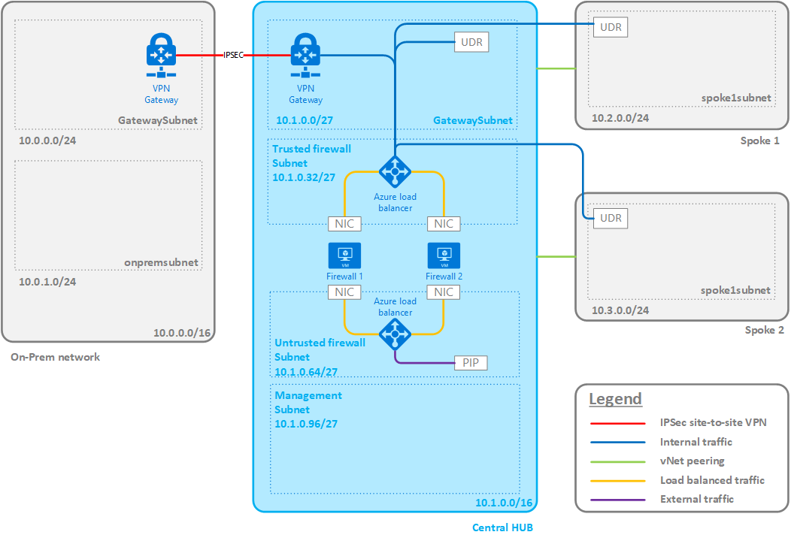

# AzureVDC

## Description

This project contains the ARM templates to deploy an Azure Virtual Datacenter as described in the Azure Virtual Datacenter Concepts eBook. This eBook can be found [here](https://aka.ms/VDC/eBook).

There is also a blog, explaining the various components that are deployed with these templates: [https://www.christofvg.be](https://www.christofvg.be).

The **primary goal of the Azure Virtual Datacenter** is to have a nice platform to learn more about Azure Networking, Load balancing, Hub-and-Spoke concepts, ... . The Azure Virtual Datacenter is a very important concept since it allows companies to extend their datacenters to the public cloud on their own pace. Workloads can be moved to the cloud and new parts can be deployed as a green-field deployment.

The **primary goal of these templates** is to have a starting point to deploy your own virtual datacenter. Since it is deployed in minutes, you could easily deploy it and remove it afterwards to train without huge infrastructure costs in Azure.

Currently the following components are part of the deployment:

* Virtual networks with their subnets
* Firewalls with their load balancers
* Management machine

In the future, other parts will be added like spoke networks, spoke workloads, on-premises network, on-premises workload, automation, policies, tags, ...

The final design would look similar to this:



## Templates

There are 2 types of templates in this repository:

* **Discrete** templates, only deploying the workload described in the directory name.
* **Master** template, linking to the discrete templates, allowing you to deploy the complete environment. Using this type of deployment will create both the resource groups and the resources.

```bash
ARM Templates
├───Hub firewalls                       # Discrete firewalls template
│       azuredeploy.json
│       azuredeploy.parameters.json
│
├───Hub network                         # Discrete network template
│       azuredeploy.json
│       azuredeploy.parameters.json
│
├───Management                          # Discrete management vm template
│       azuredeploy.json
│       azuredeploy.parameters.json
│
└───Master templates                    # Master template
        azuredeploy.json
        azuredeploy.parameters.json
```

## pfSense image

In this lab, a pfSense image is used to create the firewall instances. I wrote a blog series how to create your own pfSense image that can be deployed in Azure.

* [pfSense on Azure - Part 1 - Create pfSense Virtual Machine](https://christofvg.be/2019/01/12/pfSense-on-Azure-Part-1-Create-pfSense-Virtual-Machine/)
* [pfSense on Azure - Part 2 - Install pfSense](https://christofvg.be/2019/01/12/pfSense-on-Azure-Part-2-Install-pfSense/)
* [pfSense on Azure - Part 3 - Deploy pfSense in Azure](https://christofvg.be/2019/01/12/pfSense-on-Azure-Part-3-Deploy-pfSense-in-Azure/)
* [pfSense on Azure - Part 4 - Deploy pfSense in Azure with ARM templates](https://christofvg.be/2019/01/23/pfSense-on-Azure-Part-4-Deploy-pfSense-in-Azure-with-ARM-templates/)

## Discrete template deployment (using PowerShell)

The discrete (single) templates need to be deployed in a resource group. In my lab, they are deployed in their own resource group as they don't share a common life cycle.

So the following example script can be used to deploy a template:

```PowerShell
# Create a Resource Group
New-AzureRmResourceGroup -Name <Resource Group Name> -Location <Location>

# Deploy the template to the Resource Group you created
New-AzureRmResourceGroupDeployment -TemplateFile <path to the azuredeploy.json file> `
                                   -TemplateParameterFile <path to the azuredeploy.parameters.json file> `
                                   -Verbose
```

## Master template deployment (using PowerShell)

The master template deploys all resources, but also the resource groups. This means that another command needs to be used to perform the deployment: New-AzureRmDeployment.

The following script can be used to deploy the master template:

```PowerShell
New-AzureRmDeployment -Location <Azure location> `
                      -TemplateFile <path to the azuredeploy.json file> `
                      -TemplateParameterFile <path to the azuredeploy.parameters.json file> `
                      -Verbose
```

>**Important notice**  
>  
>Some parameters are not part of the parameters file as some parameter types like passwords don't belong in source control. They can be added as parameters in the New-AzureRmResourceGroupDeployment or New-AzureRmDeployment command.

## Parameters

### Hub Network

* **hubVnetName**: The name of the virtual network in the hub.
* **hubVnetPrefix**: The network address in CIDR notation of the network in the hub.
* **gatewaySubnetPrefix**: The network address in CIDR notation of the gateway subnet.
* **trustedSubnetName**: The name of the trusted subnet.
* **trustedSubnetPrefix**: The network address in CIDR notation of the trusted subnet.
* **untrustedSubnetName**: The name of the untrusted subnet.
* **untrustedSubnetPrefix**: The network address in CIDR notation of the untrusted subnet.
* **managementSubnetName**: The name of the management subnet.
* **managementSubnetPrefix**: The network address in CIDR notation of the management subnet.

### Hub Firewalls

* **numberOfInstances**: The number of firewall NVAs to deploy.
* **firewallNamePrefix**: The first common part of the virtual machine name of the firewalls.
* **virtualNetworkName**: The name of the virtual network.
* **virtualNetworkResourceGroup**: The name of the virtual network resource group.
* **trustedFirewallSubnet**: The name of the trusted subnet.
* **trustedSubnetIpPrefixString**: The first 3 octets of the trusted subnet, finishing with a dot.
* **trustedFirstIpHostString**: The last octet of the trusted IP address of the first firewall.
* **untrustedFirewallSubnet**: The name of the untrusted subnet.
* **untrustedSubnetIpPrefixString**: The first 3 octets of the untrusted subnet, finishing with a dot.
* **untrustedFirstIpHostString**: The last octet of the untrusted IP address of the first firewall.
* **trustedLoadBalancerIPAddress**: The IP address of the load balancer of the trusted side.
* **pfSenseVhdPath**: The relative path on the storage account of the VHD file with the pfSense image.
* **pfSenseStorageAccountName (not part of the parameters file)**: The name of the storage account where the VHD file of pfSense is stored.
* **firewallVmSize**: The VM size of the firewalls.

### Management

* **adminUserName**: The username to configure on the management virtual machine.
* **adminPassword** (not part of the parameters file): The password to configure on the management virtual machine.
* **subnetName**: The name of the subnet in which the management virtual machine needs to be connected.
* **WindowsOSVersion**: The Windows version that needs to be installed on the management virtual machine.
* **managementVMName**: The name for the management virtual machine.
* **managementVMSize**: The VM size of the management virtual machine.

### Master

All parameters that are described above are used in the parameters in the master template. Where multiple templates share the same parameters, they are specified once and used where needed.

These parameters are unique to the master template to create the resource groups as well:

* **virtualNetworkResourceGroup**: The name of the resource group in which the network resources need to be deployed.
* **firewallResourceGroup**: The name of the resource group in which the firewall resources need to be deployed.
* **managementResourceGroup**: The name of the resource group in which the management virtual machine resources need to be deployed.
* **location** The Azure location in which the resources need to be deployed.

## Next steps

To make the complete setup work, a few more steps in pfSense need to be done. In the future this should be automated as well, but for now here the high-level next steps. They will be explained more in detail on the blog.

### SSH

SSH needs to be enabled on pfSense, so it can be accessed over SSH.

### Routing

All load balancers in Azure use the same source IP for the health probe: **168.63.129.16**. A health check, originating from this address, pops-up on the LAN interface of the firewall. To have a symmetric routing, the answer of this message should go back on the LAN interface to the gateway of the trusted subnet. There are 2 reasons why this doesn't happen by default:

* The IP 168.63.129.16 is public, so it follows the route to internet (through the firewall)
* By default, a static route to 168.63.129.16/32 is already added to pfSense using classless-static-routing in DHCP

To overcome this issue, 2 things need to be done in pfSense. First the static route to 168.63.129.16 needs to be removed:

```bash
route delete 168.63.129.16
```

Then an extra gateway needs to be added on interface hn1 with address 10.1.0.33 (if addressing of the example is followed). If the gateway is added, a static route for 168.63.129.16/32 needs to be added with destination this gateway.

## More info

For  updates or questions: <a href="https://twitter.com/cvangeendert?ref_src=twsrc%5Etfw" class="twitter-follow-button" data-show-count="false">Follow @cvangeendert</a>